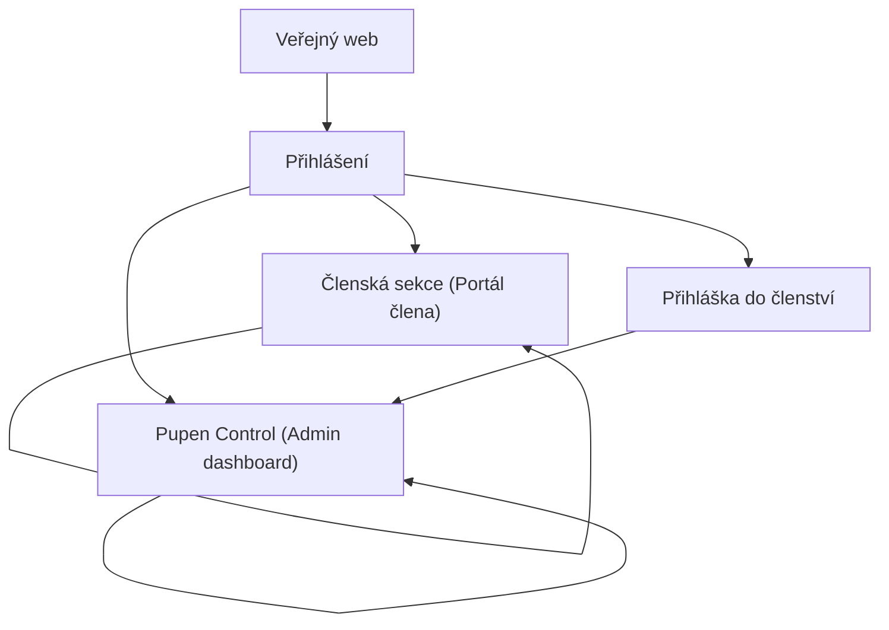

## 1. Product Overview
Pupen Control (admin) a Členská sekce jsou interní části webu Pupen pro správu obsahu, provozu a členství.
Cílem redesignu je roztřídit moduly, zjednodušit UI, zlepšit použitelnost a navigaci (desktop-first).

## 2. Core Features

### 2.1 User Roles
| Role | Registration Method | Core Permissions |
|------|---------------------|------------------|
| Administrátor | Přihlášení přes existující login (Supabase Auth) + profil s příznakem admin | Spravuje obsah a nastavení dle oprávnění, zpracuje přihlášky, pracuje s financemi a provozem |
| Člen | Přihlášení přes existující login (Supabase Auth) + profil s příznakem member | Vidí členský obsah a výhody, spravuje svůj profil |
| Neověřený uživatel | Přihlášení / bez účtu | Může se přihlásit a (pokud je relevantní) podat přihlášku do členství |

### 2.2 Feature Module
Požadavky sestávají z těchto hlavních stránek:
1. **Přihlášení**: přihlášení, obnova přístupu, routování do admin/člen.
2. **Pupen Control (Admin dashboard)**: jednotná navigace, modulové skupiny, práce s obsahem a provozem, přehled a logy.
3. **Členská sekce (Portál člena)**: přehled člena, členský obsah/výhody, profil.
4. **Přihláška do členství**: vyplnění a odeslání přihlášky, stav žádosti.

### 2.3 Page Details
| Page Name | Module Name | Feature description |
|-----------|-------------|---------------------|
| Přihlášení | Autentizace | Přihlásit uživatele a obnovit přístup (např. „poslat odkaz/heslo“), zobrazit chyby, přesměrovat podle role (admin → Pupen Control, člen → Členská sekce). |
| Pupen Control (Admin dashboard) | Informační architektura a navigace | Zobrazit pevný sidebar s modulovými skupinami, globální vyhledávání / „command palette“, zobrazení pouze modulů dle oprávnění, zapamatovat poslední aktivní modul (např. přes URL hash). |
| Pupen Control (Admin dashboard) | Roztřídění modulů (taxonomie) | Seskupit existující moduly do 5–7 jasných kategorií (např. Obsah, Komunita, Provoz, Finance, Governance, Systém) a sjednotit názvy, ikony a popisky. |
| Pupen Control (Admin dashboard) | Jednotné UI vzory | Sjednotit layout „seznam → detail“, formuláře (validace, povinná pole, ukládání), akce (primární/sekundární), potvrzovací dialogy, prázdné stavy a načítání. |
| Pupen Control (Admin dashboard) | Efektivní správa | Umožnit rychlé vytvoření/úpravu/smazání položek v rámci existujících modulů, podporovat filtrování a vyhledávání v seznamech, zobrazit stav publikace/platnosti, zobrazit audit/technické logy tam, kde už existují. |
| Pupen Control (Admin dashboard) | Profil a odhlášení | Zobrazit profil admina, umožnit úpravu základních údajů, odhlásit se. |
| Členská sekce (Portál člena) | Členský přehled | Zobrazit „dashboard“ člena (status členství, rychlé odkazy na členské funkce), jasně oddělit veřejné vs. členské části. |
| Členská sekce (Portál člena) | Členský obsah a výhody | Zobrazit členské stránky/funkce dostupné členům (např. slevy, akce, dokumenty) v konzistentní navigaci a srozumitelných kartách. |
| Členská sekce (Portál člena) | Profil | Umožnit členu upravit své základní údaje, zobrazit relevantní oznámení (např. změny stavu). |
| Přihláška do členství | Formulář a stav | Umožnit vyplnit a odeslat přihlášku, zobrazit potvrzení a stav žádosti; admin následně žádost zpracuje v rámci existujícího modulu pro přihlášky. |

## 3. Core Process
**Tok administrátora**: Přihlásíš se → systém vyhodnotí oprávnění → otevře se Pupen Control → v levém menu zvolíš kategorii a modul → pracuješ v jednotném vzoru „seznam/detail“ → uložíš změny → případně ověříš logy/preview → odhlásíš se.

**Tok člena**: Přihlásíš se → otevře se Členská sekce → z přehledu přejdeš na členský obsah/výhody → případně upravíš profil → odhlásíš se.

**Tok nečlena (žádost)**: Přihlásíš se nebo otevřeš přihlášku → vyplníš formulář → odešleš → sleduješ stav → po schválení získáš přístup do Členské sekce.

