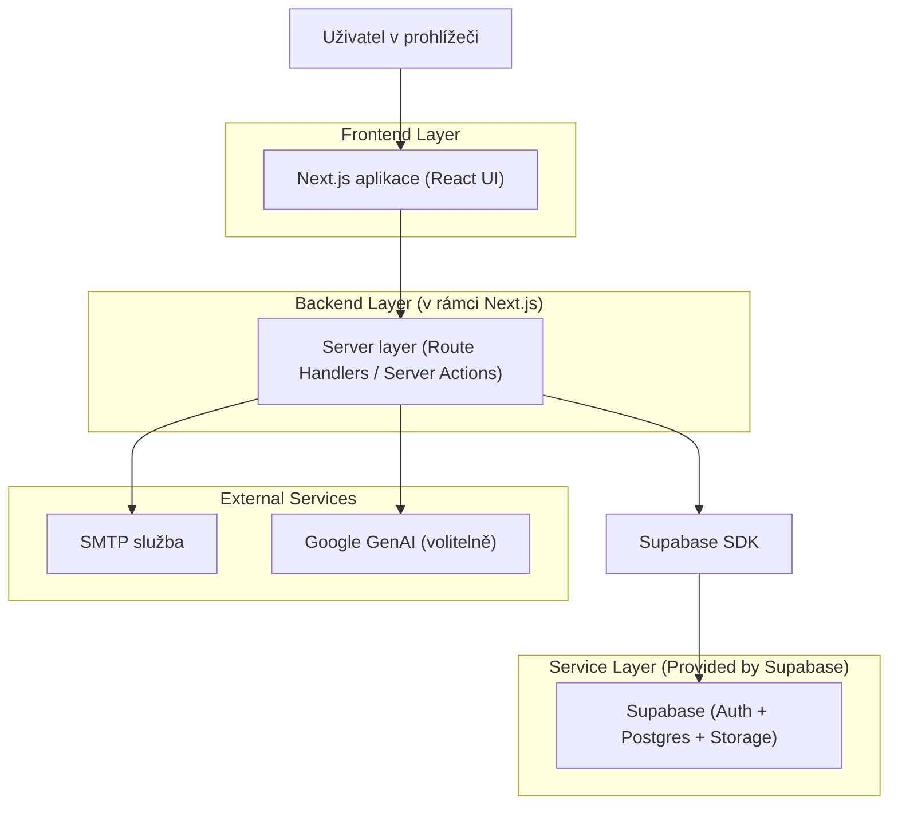
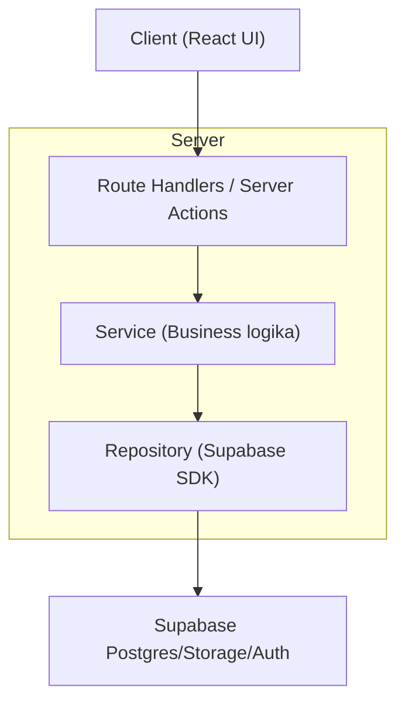
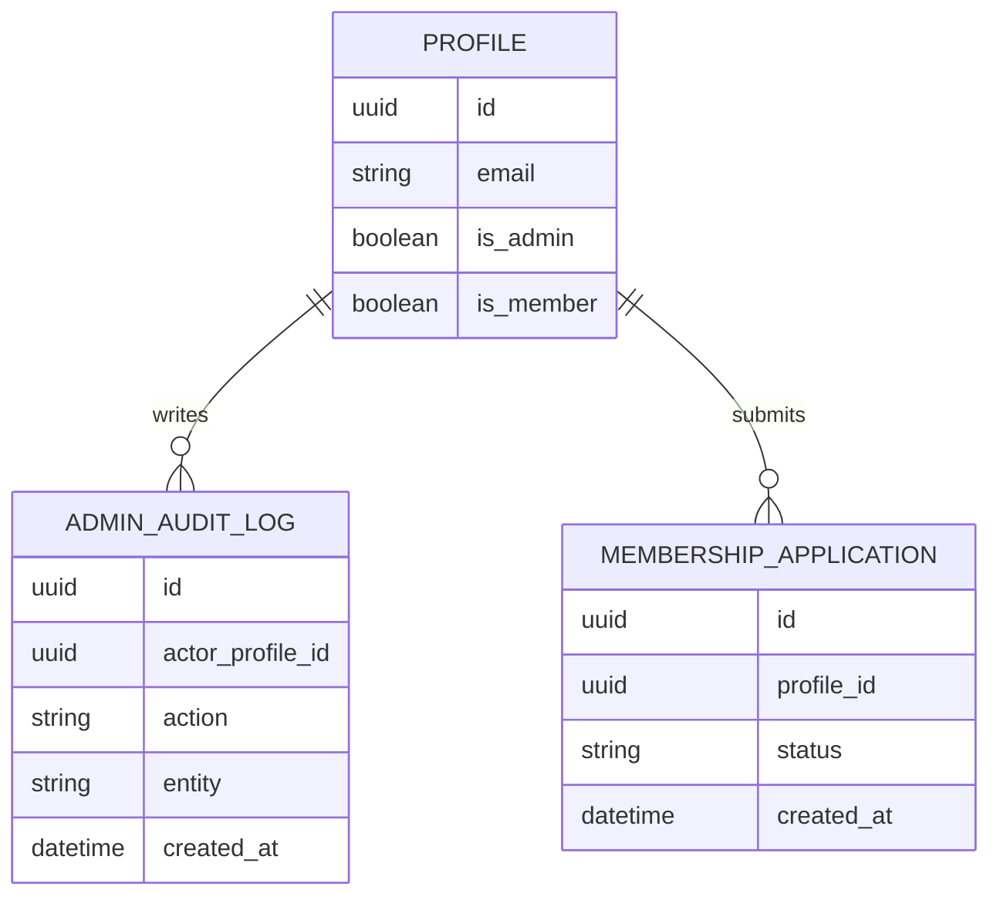

## 1.Architecture design


## 2.Technology Description
- Frontend: Next.js@16 + React@19 + tailwindcss@4 + lucide-react
- Backend: Next.js Route Handlers (Node runtime) + nodemailer + zod
- Data/State: @tanstack/react-query + react-hook-form
- Backend service: Supabase (Auth + PostgreSQL + Storage)

## 3.Route definitions
| Route | Purpose |
|-------|---------|
| /[lang]/login | Přihlášení a směrování dle role |
| /[lang]/admin | Vstup do adminu (redirect na login) |
| /[lang]/admin/dashboard | Pupen Control – sjednocený admin dashboard |
| /[lang]/clen | Členský portál |
| /[lang]/clen/prihlaska | Přihláška do členství |

## 4.API definitions (If it includes backend services)
### 4.1 Core API
Administrace a automatizace (příklady existujících route handlerů)
```
POST /api/admin/send-password
POST /api/admin/send-ticket
GET  /api/admin/digest
GET  /api/admin/promo/rules
POST /api/admin/promo/rules/set
POST /api/admin/refunds/update
GET  /api/admin/refunds/logs
```
Komunikace a GDPR (příklady)
```
POST /api/dm/send
GET  /api/dm/threads
POST /api/gdpr/export
POST /api/gdpr/delete
```

Sdílené TypeScript typy (koncept)
```ts
type Lang = 'cs' | 'en';

type UserProfile = {
  id: string; // UUID
  email?: string;
  first_name?: string;
  last_name?: string;
  is_admin?: boolean;
  is_member?: boolean;
  can_manage_admins?: boolean;
  // + can_view_X / can_edit_X dle modulů
};

type AdminModuleGroup = 'Obsah' | 'Komunita' | 'Provoz' | 'Finance' | 'Governance' | 'Systém';

type AdminNavItem = {
  id: string; // např. 'events'
  label: string;
  group: AdminModuleGroup;
  requiredPermission?: string; // např. 'can_view_events'
};
```

## 5.Server architecture diagram (If it includes backend services)


## 6.Data model(if applicable)
### 6.1 Data model definition
Konceptuálně (s důrazem na role/opr.)

