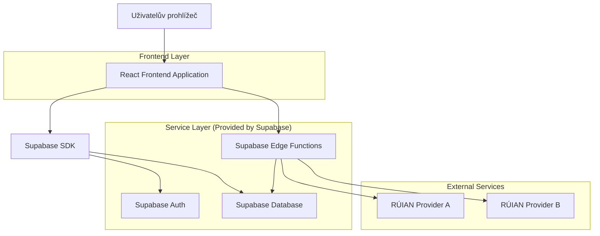
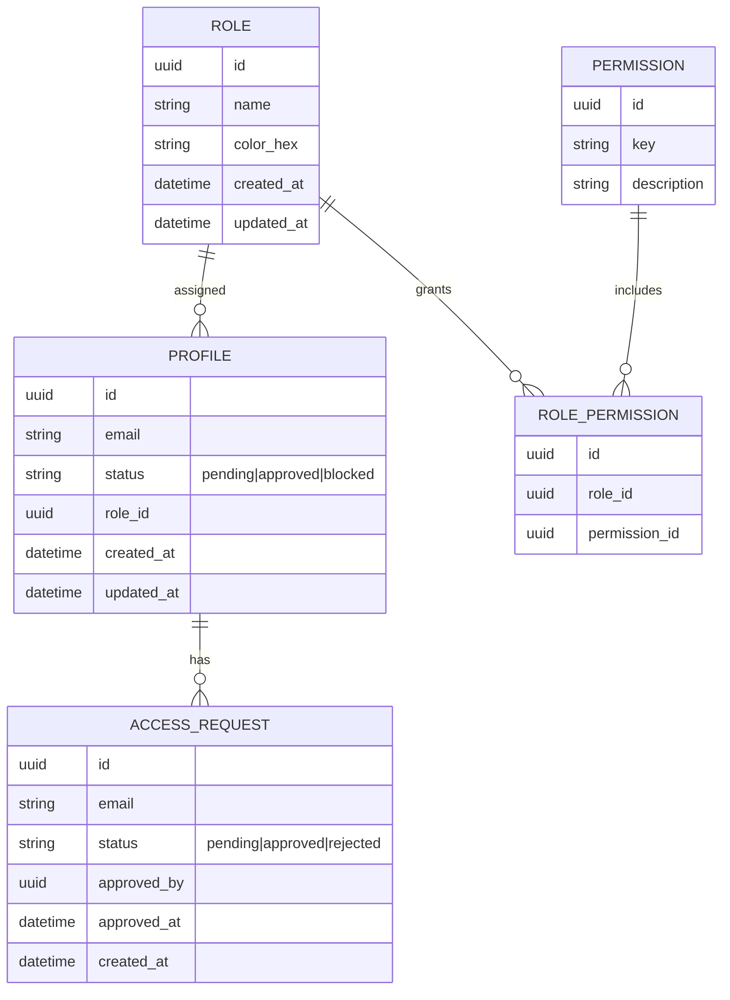

## 1.Architecture design


## 2.Technology Description
- Frontend: React@18 + TypeScript + vite + tailwindcss@3
- Backend: Supabase (Auth + Postgres + Edge Functions)

## 3.Route definitions
| Route | Purpose |
|-------|---------|
| /login | Přihlášení e‑mail/heslo + reset hesla |
| /app | Hlavní aplikace (RÚIAN test/validace, stav účtu) |
| /admin | Admin portál (gating, schvalování přístupů, RBAC, provider, schema cache) |

## 4.API definitions (If it includes backend services)
### 4.1 Edge Functions (volané z frontendu)

**RÚIAN lookup/validace (sjednocený endpoint přes aktivního providera)**
```
POST /functions/v1/ruian/lookup
```
Request:
| Param Name| Param Type | isRequired | Description |
|---|---:|---:|---|
| query | string | true | Text adresy/části adresy k vyhledání |
| mode | 'search' \| 'validate' | true | Režim dotazu |
Response:
| Param Name| Param Type | Description |
|---|---|---|
| provider | string | Použitý provider |
| items | Array<any> | Nalezené položky (provider-normalizované minimum) |
| error | {code:string,message:string} \| null | Chyba providera, pokud nastane |

**Schema cache refresh/invalidate (admin-only)**
```
POST /functions/v1/schema-cache/refresh
POST /functions/v1/schema-cache/invalidate
```
Request (refresh):
| Param Name| Param Type | isRequired | Description |
|---|---:|---:|---|
| scope | 'all' \| string | true | Co refreshovat (např. klíč/namespace) |

## 6.Data model(if applicable)

### 6.1 Data model definition


### 6.2 Data Definition Language
Profile (profiles)
```
CREATE TABLE profiles (
  id UUID PRIMARY KEY,
  email VARCHAR(255) UNIQUE NOT NULL,
  status VARCHAR(20) NOT NULL DEFAULT 'pending',
  role_id UUID NULL,
  created_at TIMESTAMPTZ NOT NULL DEFAULT NOW(),
  updated_at TIMESTAMPTZ NOT NULL DEFAULT NOW()
);
```

Role (roles)
```
CREATE TABLE roles (
  id UUID PRIMARY KEY DEFAULT gen_random_uuid(),
  name VARCHAR(80) UNIQUE NOT NULL,
  color_hex VARCHAR(7) NOT NULL DEFAULT '#64748B',
  created_at TIMESTAMPTZ NOT NULL DEFAULT NOW(),
  updated_at TIMESTAMPTZ NOT NULL DEFAULT NOW()
);
```

Permission (permissions)
```
CREATE TABLE permissions (
  id UUID PRIMARY KEY DEFAULT gen_random_uuid(),
  key VARCHAR(120) UNIQUE NOT NULL,
  description VARCHAR(255)
);
```

Role-Permission (role_permissions)
```
CREATE TABLE role_permissions (
  id UUID PRIMARY KEY DEFAULT gen_random_uuid(),
  role_id UUID NOT NULL,
  permission_id UUID NOT NULL
);
```

Access requests (access_requests)
```
CREATE TABLE access_requests (
  id UUID PRIMARY KEY DEFAULT gen_random_uuid(),
  email VARCHAR(255) NOT NULL,
  status VARCHAR(20) NOT NULL DEFAULT 'pending',
  approved_by UUID NULL,
  approved_at TIMESTAMPTZ NULL,
  created_at TIMESTAMPTZ NOT NULL DEFAULT NOW()
);
```

App settings (app_settings) – přepínatelný provider + verze pro cache
```
CREATE TABLE app_settings (
  id UUID PRIMARY KEY DEFAULT gen_random_uuid(),
  active_ruian_provider VARCHAR(80) NOT NULL DEFAULT 'provider_a',
  schema_cache_version INTEGER NOT NULL DEFAULT 1,
  updated_by UUID NULL,
  updated_at TIMESTAMPTZ NOT NULL DEFAULT NOW()
);
```

Schema cache (schema_cache) – oprava typických chyb konzistence
```
CREATE TABLE schema_cache (
  id UUID PRIMARY KEY DEFAULT gen_random_uuid(),
  cache_key VARCHAR(160) NOT NULL,
  version INTEGER NOT NULL,
  payload_json JSONB NOT NULL,
  provider VARCHAR(80) NULL,
  created_at TIMESTAMPTZ NOT NULL DEFAULT NOW(),
  updated_at TIMESTAMPTZ NOT NULL DEFAULT NOW()
);

CREATE INDEX idx_schema_cache_key_version ON schema_cache(cache_key, version);
CREATE INDEX idx_schema_cache_updated_at ON schema_cache(updated_at DESC);
```

Základní práva (doporučení)
```
GRANT SELECT ON roles TO anon;
GRANT SELECT ON permissions TO anon;
GRANT ALL PRIVILEGES ON profiles TO authenticated;
GRANT ALL PRIVILEGES ON access_requests TO authenticated;
GRANT ALL PRIVILEGES ON app_settings TO authenticated;
GRANT ALL PRIVILEGES ON schema_cache TO authenticated;
```
